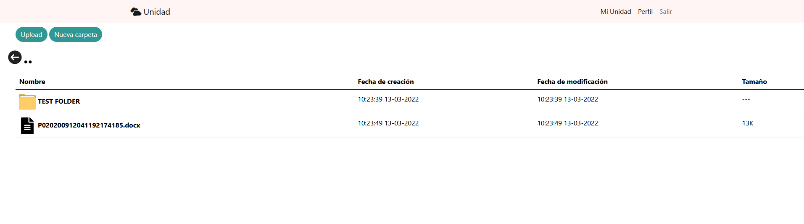

# Project of CFGS ASIR
MyHomeCloud is a cloud storage that works in local mode.

### Snapshots
#### Login/Register Page


### Main Page


## How to Run
#### Install the requirements. You can use the following command:
```
python -m pip install -r requirement.txt
```

#### Need to install this following application:
#### MySQL
#### Windows
MySQL Installer: https://dev.mysql.com/downloads/installer/

    - Select MySQL Server and Workbench in the installation

After the installation, connect to you MySQL and run this following SQL script:
```
CREATE DATABASE IF NOT EXISTS `applogin` DEFAULT CHARACTER SET utf8 COLLATE utf8_general_ci;
```
```
USE `applogin`;
DROP TABLE IF EXISTS accounts;
CREATE TABLE IF NOT EXISTS `accounts` (
	`id` int(11) NOT NULL AUTO_INCREMENT,
    	`level` varchar(20) NOT NULL DEFAULT('user'),
  	`username` varchar(50) NOT NULL,
  	`password` varchar(255) NOT NULL,
  	`email` varchar(100) NOT NULL,
    `folder_name` varchar(1000) NOT NULL,
    CONSTRAINT UserID_folder PRIMARY KEY (`id`, `folder_name`)
) ENGINE=InnoDB AUTO_INCREMENT=0 DEFAULT CHARSET=utf8;
```
Create a config.env file, copy the following lines into it and **edit them**:
```
export SECRET_KEY="YOUR SECRET KEY"
export MYSQL_USER="MYSQL USERNAME"
export MYSQL_PASSWORD="MYSQL PASSWORD"
export MYSQL_HOST="MYSQL HOST"
export MYSQL_DB="MYSQL DATABASE NAME"
export BASE_DIR="PATH WHERE YOU WANT TO STORAGE"
```
> **For now, only works on Windows**
#### Linux
##### Ubuntu/Debian/PopOS/...
$ sudo apt-get install mysql-server
##### ArchLinux/Manjaro...
$ sudo pacman -S mysql-server

Configure your MySQL Server and run this following SQL script:
```
CREATE DATABASE IF NOT EXISTS `applogin` DEFAULT CHARACTER SET utf8 COLLATE utf8_general_ci;
```
```
USE `applogin`;
DROP TABLE IF EXISTS accounts;
CREATE TABLE IF NOT EXISTS `accounts` (
	`id` int(11) NOT NULL AUTO_INCREMENT,
    `level` varchar(20) NOT NULL DEFAULT('user'),
  	`username` varchar(50) NOT NULL,
  	`password` varchar(255) NOT NULL,
  	`email` varchar(100) NOT NULL,
    `folder_name` varchar(1000) NOT NULL,
    CONSTRAINT UserID_folder PRIMARY KEY (`id`, `folder_name`)
) ENGINE=InnoDB AUTO_INCREMENT=0 DEFAULT CHARSET=utf8;
```
